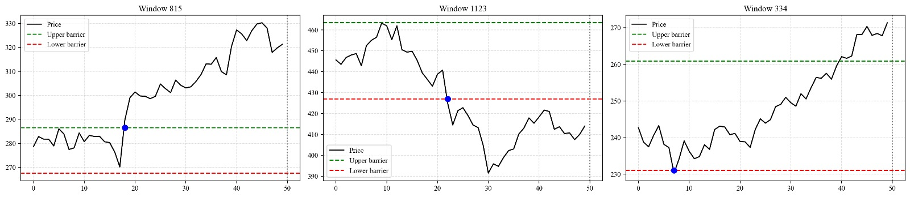
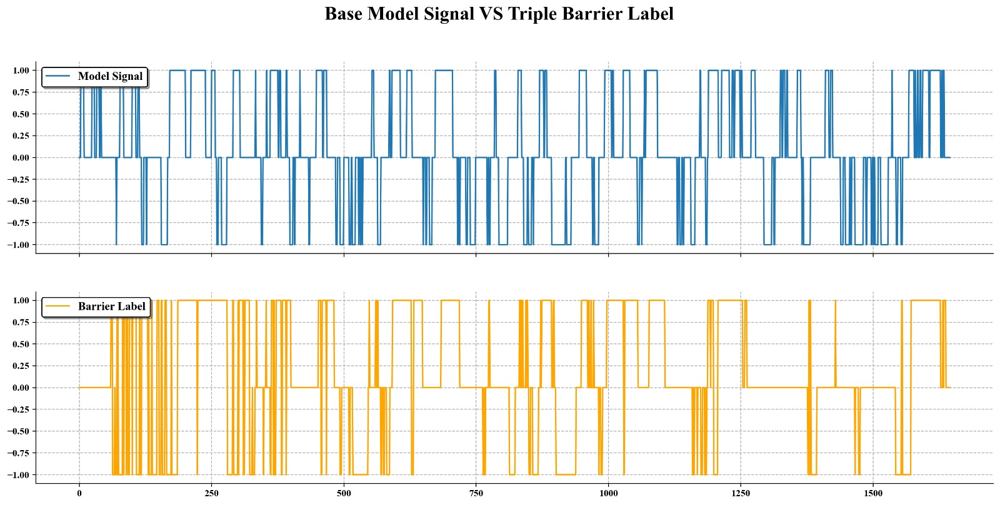

# Financial Labelling

## Overview
**Financial Labelling** is a research-oriented project that explores the use of **meta-labelling** to improve the quality of trading signals.  
The project demonstrates how to combine a simple trading strategy (based on Bollinger Bands) with **Triple-Barrier Labelling** and machine learning models to filter, calibrate, and enhance raw signals.  
The framework provides both reusable code modules and reproducible experiments in Jupyter notebooks.

---

## 📂 Project Structure

```text
financial-labelling/
│
├── src/
│   └── TripleBarrierLabelling/       # Implementation of Triple-Barrier Labelling
│
├── notebooks/
│   ├── 00_TripleBarrierLabel.ipynb   # Guide to using the TripleBarrierLabel object
│   └── 01_MetaLabelling.ipynb        # Experiment showing how to build a meta-model
│                                      # on top of raw signals and triple-barrier labels
│
├── images/                           # Figures, plots, and illustrations
│
├── requirements.txt                  # Project dependencies
│
├── README.md                         # Project documentation

```

---

## ✨ Features
- **Triple-Barrier Labelling**  
  Implementation of López de Prado’s labelling technique for financial time series.  

- **Meta-Labelling Framework**  
  Demonstrates how a meta-model can filter and improve base strategy signals.  

- **Example Trading Strategy**  
  A simple Bollinger-based strategy with short-term moving average and persistence filter, used as the baseline.  

- **Machine Learning Models**  
  Logistic Regression, SVC, Random Forest, Gradient Boosting, and Stacking — all trained with calibrated probabilities and validated using **TimeSeriesEmbargoCV** to prevent information leakage between folds.  

- **Embargo Cross-Validation**  
  Custom **TimeSeriesEmbargoCV** implementation adds an embargo period between training and test sets, ensuring realistic evaluation in time-series data.  

- **Backtesting**  
  Vectorbt-based portfolio simulation comparing raw signals against meta-model enhanced signals.  


*Figure 1: Example of triple-barrier labeling with horizon and barriers*


*Figure 2: Example of Bollinger-based strategy signal agains Triple Barrier Labels*


*Figure 3: Illustration of how time-to-hit and event uniqueness jointly determine the final sample weight*

---

## ▶️ Usage

- **Triple-Barrier Labelling**  
  Open `notebooks/00_TripleBarrierLabel.ipynb` to see how the `TripleBarrierLabel` object is applied to raw price data in order to generate event labels (+1, 0, -1).  

- **Meta-Labelling**  
  In `notebooks/01_MetaLabelling.ipynb`, a simple Bollinger-based trading strategy is combined with triple-barrier labels to create a binary target, and several ML models are trained to predict the reliability of the signals.  

- **Backtesting**  
  The notebooks also include a backtesting workflow using **vectorbt**, allowing comparison between the base strategy and the meta-model enhanced strategy (including position sizing based on predicted probabilities).  


---

## 📦 Requirements
- pandas==2.2.3  
- numpy==1.23.5  
- scipy==1.15.2  
- matplotlib==3.6.3  
- seaborn==0.12.2  
- yfinance==0.2.64  
- vectorbt==0.28.0  
- scikit-learn==1.6.1  
- Custom modules from GitHub:  
  - [financial-labelling](https://github.com/JohnsoN98X/financial-labeling)  
  - [quant-utilities](https://github.com/JohnsoN98X/quant-utilities)  

--- 

## 📥 Installation

To set up the project environment, follow these steps:

1. **Clone the repository**  
   Download the source code from GitHub and move into the project directory:  
   ```bash
   git clone https://github.com/JohnsoN98X/financial-labelling.git
   cd financial-labelling
   ```
2. Create a Virtual environment
   ```bash
   python -m venv venv
   source venv/bin/activate        # On Linux/Mac
   venv\Scripts\activate           # On Windows
   ```
3. Install Dependencies
   ```bash
   pip install -r requirements.txt
   ```
---

## 📜 Documentation

This README provides a high-level overview.  
Full API documentation is available in the source code docstrings and can be expanded in a dedicated `docs/` folder or project wiki.  

--- 

## 🔮 Future Work

Possible extensions for this project include:

- Adaptation of the code to work with **Imbalance Volume Bars (IVB)** and other non-time-based bars.  
- Training the meta-model on a **cluster of assets** in order to improve its generalization capability.  

---

## ⚠️ Disclaimer

This project is for research and educational purposes only.  
It is **not** financial advice or a recommendation to trade or invest. Use at your own risk.  

---

## ⚖️ License

This project is licensed under the MIT License.